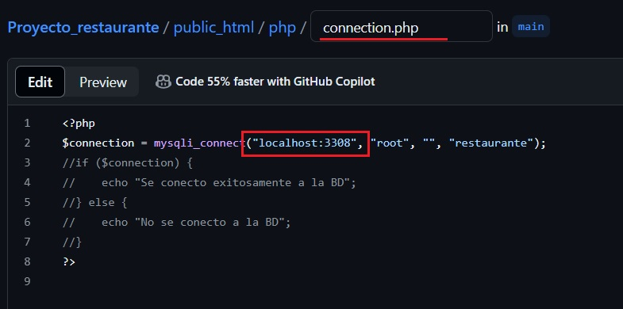

## Primera Actualizacion
- Se requiere de una base de datos local en phpmyadmi llamada restaurante para poder ejecutar el proyecto y la tabla clientes para la lectura de los usuarios.
```sql
-- Para avance 5 usar--
CREATE DATABASE restaurante;
USE restaurante;
CREATE TABLE clientes (
  id INT PRIMARY KEY AUTO_INCREMENT,
  nombre_completo VARCHAR(50),
  correo VARCHAR(50),
  usuario VARCHAR(150),
  contrasena VARCHAR(150)
);
```
## Posterior Actualizacion
- Todavia no usar esta base de datos
```sql
CREATE DATABASE restaurante;
USE restaurante;
CREATE TABLE Category
( 
	category_id          integer  NOT NULL ,
	name                 varchar(20)  NOT NULL 
)
go

ALTER TABLE Category
	ADD CONSTRAINT XPKCategory PRIMARY KEY  CLUSTERED (category_id ASC)
go

CREATE TABLE Cliente
( 
	client_id            integer  NOT NULL ,
	fullname             varchar(30)  NOT NULL ,
	password             varchar(20)  NOT NULL ,
	direccion            varchar(30)  NOT NULL ,
	phone_number         char(9)  NOT NULL ,
	email                varchar(20)  NOT NULL 
)
go

ALTER TABLE Cliente
	ADD CONSTRAINT XPKCliente PRIMARY KEY  CLUSTERED (client_id ASC)
go

CREATE TABLE Location
( 
	location_id          integer  NOT NULL ,
	district             varchar(50)  NOT NULL ,
	direccion            varchar(20)  NOT NULL ,
	city                 varchar(30)  NOT NULL 
)
go

ALTER TABLE Location
	ADD CONSTRAINT XPKLocation PRIMARY KEY  CLUSTERED (location_id ASC)
go

CREATE TABLE Metodo_Pago
( 
	metodo_pago_id       integer  NOT NULL ,
	name                 varchar(20)  NOT NULL 
)
go

ALTER TABLE Metodo_Pago
	ADD CONSTRAINT XPKMetodo_Pago PRIMARY KEY  CLUSTERED (metodo_pago_id ASC)
go

CREATE TABLE Order_Detail
( 
	order_detail_id      integer  NOT NULL ,
	cantidad_platos      integer  NOT NULL ,
	subtotal             integer  NOT NULL ,
	order_id             integer  NULL ,
	plato_id             varchar(20)  NULL 
)
go

ALTER TABLE Order_Detail
	ADD CONSTRAINT XPKOrder_Detail PRIMARY KEY  CLUSTERED (order_detail_id ASC)
go

CREATE TABLE Orders
( 
	order_id             integer  NOT NULL ,
	description          varchar(50)  NOT NULL ,
	fecha                datetime  NOT NULL ,
	hora                 datetime  NOT NULL ,
	tipo_pedido          varchar(30)  NOT NULL ,
	precio_total         float  NULL ,
	location_id          integer  NULL ,
	client_id            integer  NULL ,
	metodo_pago_id       integer  NULL 
)
go

ALTER TABLE Orders
	ADD CONSTRAINT XPKOrders PRIMARY KEY  CLUSTERED (order_id ASC)
go

CREATE TABLE Plato
( 
	plato_id             varchar(20)  NOT NULL ,
	name                 varchar(20)  NOT NULL ,
	price                float  NULL ,
	description          varchar(50)  NOT NULL ,
	category_id          integer  NULL 
)
go

ALTER TABLE Plato
	ADD CONSTRAINT XPKPlato PRIMARY KEY  CLUSTERED (plato_id ASC)
go

CREATE TABLE Reservation
( 
	reservation_id       varchar(20)  NOT NULL ,
	res_fullname         varchar(20)  NULL ,
	res_companions       integer  NOT NULL ,
	res_email            varchar(20)  NOT NULL ,
	fecha                datetime  NOT NULL ,
	hora                 datetime  NOT NULL ,
	mensaje_adicional    varchar(20)  NULL ,
	location_id          integer  NULL 
)
go

ALTER TABLE Reservation
	ADD CONSTRAINT XPKReservation PRIMARY KEY  CLUSTERED (reservation_id ASC)
go

ALTER TABLE Order_Detail
	ADD CONSTRAINT R_6 FOREIGN KEY (order_id) REFERENCES Orders(order_id)
		ON DELETE NO ACTION
		ON UPDATE NO ACTION
go

ALTER TABLE Order_Detail
	ADD CONSTRAINT R_7 FOREIGN KEY (plato_id) REFERENCES Plato(plato_id)
		ON DELETE NO ACTION
		ON UPDATE NO ACTION
go

ALTER TABLE Orders
	ADD CONSTRAINT R_2 FOREIGN KEY (location_id) REFERENCES Location(location_id)
		ON DELETE NO ACTION
		ON UPDATE NO ACTION
go

ALTER TABLE Orders
	ADD CONSTRAINT R_3 FOREIGN KEY (client_id) REFERENCES Cliente(client_id)
		ON DELETE NO ACTION
		ON UPDATE NO ACTION
go

ALTER TABLE Orders
	ADD CONSTRAINT R_4 FOREIGN KEY (metodo_pago_id) REFERENCES Metodo_Pago(metodo_pago_id)
		ON DELETE NO ACTION
		ON UPDATE NO ACTION
go

ALTER TABLE Plato
	ADD CONSTRAINT R_5 FOREIGN KEY (category_id) REFERENCES Category(category_id)
		ON DELETE NO ACTION
		ON UPDATE NO ACTION
go

ALTER TABLE Reservation
	ADD CONSTRAINT R_1 FOREIGN KEY (location_id) REFERENCES Location(location_id)
		ON DELETE NO ACTION
		ON UPDATE NO ACTION
go

INSERT INTO Location (location_id, district, direccion, city)
VALUES (1, 'Miraflores', 'Av La Colmena-Bellavista, Garcia Nelaza 1948', 'Lima');
go

INSERT INTO Location (location_id, district, direccion, city)
VALUES (2, 'Santiago de Surco', 'Av Paraiso, Mendoza 1568', 'Lima');
go

INSERT INTO Location (location_id, district, direccion, city)
VALUES (3, 'San Isidro', 'Av Primavera, Magna Loza 4157', 'Lima');
go
```
## Cambio de puertos
- Cambiar el puerto, dependiendo de tu servidor local (XAMPP), para evitar conflictos.


